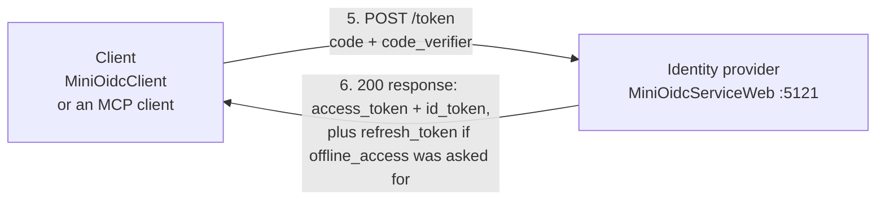
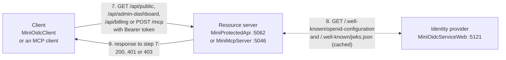
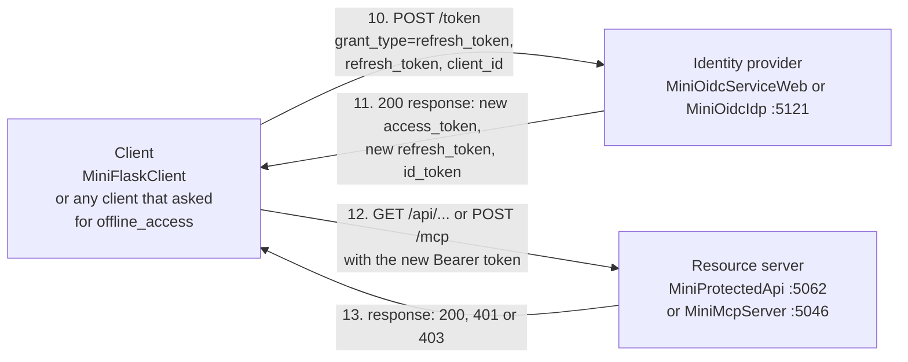
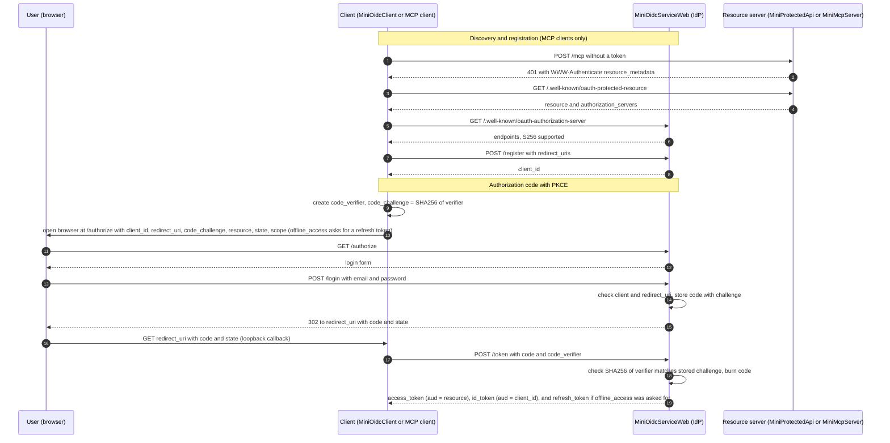
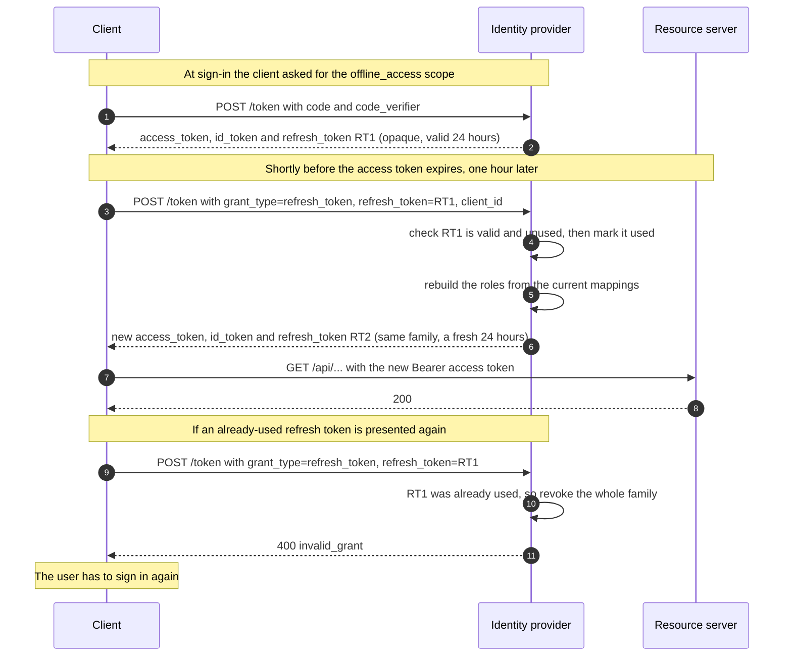
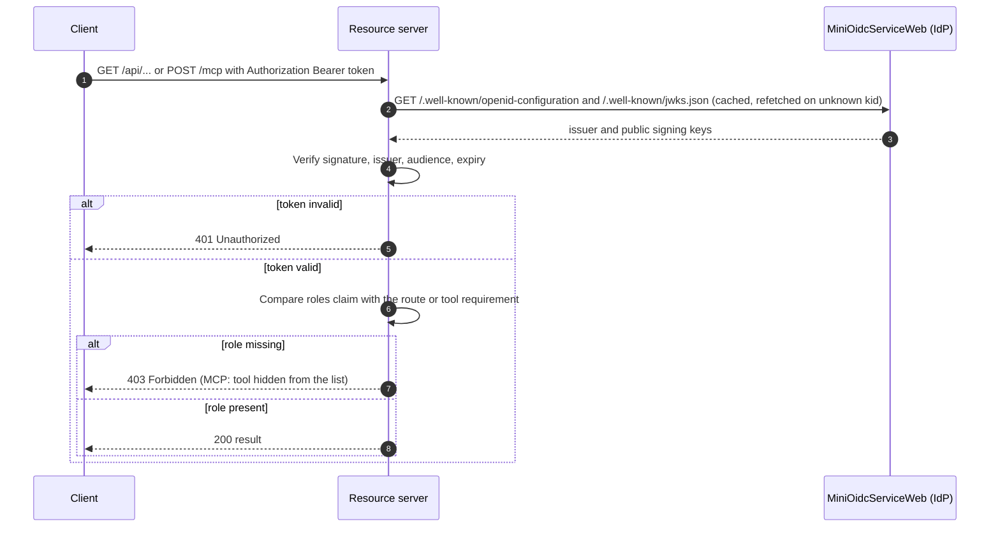

# OAuth + OIDC Learning Sandbox

A small, self-contained set of .NET 10 projects that demonstrate how OAuth 2.0 / OpenID Connect login and token-based authorization work end to end: an identity provider, a console client, a protected REST API, and a protected MCP server.

Everything is a **mock for learning**. State is in memory, passwords are plaintext, and nothing here is production-ready (see [Limitations](#limitations)).

## Projects

| Project | Kind | Default URL | What it does |
|---|---|---|---|
| **MiniOidcService** | Console app | n/a | Step-zero demo: builds and signs a JWT with a fresh RSA key and prints it (paste into jwt.io). Standalone, not used by the others. |
| **MiniOidcServiceWeb** | ASP.NET minimal API | `http://localhost:5121` | The **identity provider**. Shows a login form, issues signed JWTs, publishes its public keys and metadata, and supports dynamic client registration. |
| **MiniOidcIdp** | ASP.NET minimal API | `http://localhost:5121` | An alternative **identity provider** with pluggable sign-in (fake users, or Windows authentication) and group-to-role mapping you can edit in a browser. Same endpoints as MiniOidcServiceWeb, so run one or the other. See [MiniOidcIdp](#minioidcidp-role-mapping-and-windows-sign-in). |
| **MiniOidcClient** | Console app | listens on `http://localhost:8080/callback/` | A **client application**. Opens your browser to log in, catches the redirect, exchanges the code for tokens, then calls the protected API. |
| **MiniFlaskClient** | Python Flask app | `http://localhost:8080` | A web **client application** in Python. Signs you in through the IdP (authorization code + PKCE, ID token checked against the IdP's keys), calls the API's three endpoints with the access token, and shows each result. It asks for a refresh token and renews the access token before it expires. Shares port 8080 with MiniOidcClient, so run one at a time. |
| **MiniProtectedApi** | ASP.NET minimal API | `http://localhost:5062` | A **resource server**. Validates bearer tokens from the identity provider and enforces roles. |
| **MiniMcpServer** | ASP.NET MCP server | `http://localhost:5046/mcp` | A protected **MCP server** (Streamable HTTP). Same token validation, plus the discovery documents MCP clients need. |

## How the pieces talk

The numbers show the order of a login followed by an API call, split into three parts so the arrows stay readable. Each arrow points the way the message travels. The client is either MiniOidcClient or an MCP client such as Claude Code, and the resource server is either MiniProtectedApi or MiniMcpServer.

**Steps 1-4: browser login**


**Steps 5-6: token exchange**



**Steps 7-9: calling the protected API or MCP server**



Step 8 is a two-way dotted arrow because it is a request and its response. MCP clients also make these calls before step 1: `GET /.well-known/oauth-protected-resource` on the MCP server, then `GET /.well-known/oauth-authorization-server` and `POST /register` on the identity provider. They are shown in the sequence diagram below.

**Steps 10-13: refreshing an access token that is about to expire**

An access token lasts one hour. A client that asked for the `offline_access` scope also received a refresh token, and uses it to get a new access token without sending the user back to the login page. The numbers continue from step 9.



The refresh token is single-use. Step 11 hands back a new one, and the client must keep that and throw the old one away. If an old one is ever presented again, the IdP treats it as stolen and cancels every refresh token from that sign-in, so the user has to sign in again. The [Refresh token flow](#refresh-token-flow) section below shows this in detail.

## Identity provider endpoints (MiniOidcServiceWeb)

| Endpoint | Purpose |
|---|---|
| `GET /authorize` | Validates the request (registered client, exact `redirect_uri`, `S256` PKCE) and shows the login form. |
| `POST /login` | Checks credentials, creates a one-time authorization code, redirects back to the client with `code` and `state`. A wrong email or password shows the login form again with a generic "Incorrect email or password" message and keeps the request details so the user can retry. |
| `POST /token` | Two grants. `authorization_code`: verifies the PKCE `code_verifier`, burns the code, returns an `access_token` and an `id_token` (and a `refresh_token` if the request asked for the `offline_access` scope). `refresh_token`: swaps a refresh token for a new set of tokens. |
| `POST /register` | Dynamic client registration (RFC 7591) for public clients. Accepts https or loopback-http redirect URIs. |
| `GET /.well-known/openid-configuration` and `/.well-known/oauth-authorization-server` | Metadata: endpoints, supported methods. |
| `GET /.well-known/jwks.json` | The public signing key. The RSA key is regenerated on every start, so the `kid` changes too. |

**Mock users** (password `password123`): `jane.doe@example.com` has roles `Admin` and `BillingManager`. `john.smith@example.com` has only `BillingManager`.

**Pre-registered client:** `my_learning_client_app` with redirect `http://localhost:8080/callback/`.

**Token lifetimes:** both IdPs read `Tokens:AccessTokenSeconds` (default 3600) and `Tokens:RefreshTokenSeconds` (default 86400) from `appsettings.json`. Override with `Tokens__AccessTokenSeconds=6` and so on, which is handy for watching a refresh happen without waiting an hour.

## MiniOidcIdp: role mapping and Windows sign-in

MiniOidcIdp is meant for setups where users already sign in with Windows (NTLM or Kerberos) and downstream services can't receive that identity directly. The IdP does the Windows sign-in once and issues tokens the other services can validate. It changes two things compared with MiniOidcServiceWeb:

1. **Where the user comes from** (`Idp:AuthenticationMode` in `appsettings.json`):

   | Mode | Sign-in | Use for |
   |---|---|---|
   | `Persona` (default) | The login form, checked against fake users in `Idp:Personas` | Linux, or any development without Windows auth |
   | `WindowsKestrel` | Windows authentication through the Negotiate handler, no form | Windows development on Kestrel |
   | `WindowsIis` | Windows authentication done by IIS, no form | The IIS deployment |

2. **Where roles come from:** the token's `roles` are not hardcoded. Each user's groups (AD, local, or persona groups) are matched against `Idp:RoleMappings`, for example `DEMO\App-Billing` to `BillingManager`. A mapping's group can be a name (`DOMAIN\Group`) or a SID. A SID survives a group rename.

Other differences: the token `sub` is the user's SID, and a `preferred_username` claim carries the account name.

**Admin page:** `http://localhost:5121/admin/roles` (raw JSON at `/admin/roles.json`). For each user it shows their groups, which mappings matched, and the roles that go into their token. It also lets you add and remove mappings, with a shortcut to map a group you can see in the list.
- It is on by default only in Development (`Idp:EnableAdminUi`).
- Roles are worked out at sign-in, so an edit affects new sign-ins only. Tokens already issued keep their old roles until they expire.
- Edits are saved to `role-mappings.json` (in `%LOCALAPPDATA%\MiniOidc` or `~/.local/share/MiniOidc`, or the path in `Idp:MappingsFile`). That file overrides the mappings in `appsettings.json`. Delete it to go back to them.
- In Windows modes, only members of `Idp:AdminGroup` can edit, and if it is empty nobody can. Every edit needs an anti-forgery token, since a browser sends Windows credentials automatically, and each edit is logged with who made it.
- To find your real group names, sign in to the admin page on the deployed site and read the group list.

**Testing status:** Persona mode is tested (roles, editing, persistence, and against MiniProtectedApi and MiniMcpServer unchanged). The two Windows modes compile but have not been run, because that needs a Windows machine. On a non-Windows machine they refuse to start.

## Tokens

| Token | Audience (`aud`) | Purpose |
|---|---|---|
| `id_token` | the client's `client_id` | Tells the client who logged in. MiniOidcClient also sends it to MiniProtectedApi as a shortcut. |
| `access_token` | the `resource` the client asked for (falls back to `client_id`) | What an API or MCP server should accept. Audience binding stops a token for one service being replayed at another. |
| `refresh_token` | only the IdP's `/token` endpoint | Swaps for a new access token when the old one expires. Issued only when the client asked for `offline_access`. |

The `id_token` and `access_token` are RS256 JWTs carrying `iss`, `jti` (unique per token), `sub`, `name`, `preferred_username` (MiniOidcIdp only), `roles`, `exp`, `iat`. The access token also carries `client_id` and `scope`. The `offline_access` scope only asks for a refresh token, so it is left out of the access token's own `scope` claim.

**Lifetimes:** the access token and ID token last 1 hour. The refresh token lasts 24 hours and is *sliding*: every refresh returns a new refresh token with a fresh 24 hours, so a client that keeps refreshing stays signed in.

**The refresh token is opaque:** a random string (`rt_...`), not a JWT. Only the IdP can say what it means, and it lives in the IdP's memory, so restarting the IdP invalidates every refresh token.

**How this compares with Entra ID and Okta** (from their documentation when checked. Confirm the details for your own tenant):

| Behavior | This repo | Entra ID | Okta |
|---|---|---|---|
| How a refresh token is requested | `offline_access` scope | `offline_access` scope | `offline_access` scope |
| Refresh request from a public client | `grant_type`, `refresh_token`, `client_id`, optional `scope` (the same or fewer scopes) | same | same |
| Refresh token format | opaque | opaque | opaque |
| Replaced on every use | yes | yes | yes by default (configurable) |
| An old token used again | revoked immediately, along with every token from that sign-in | the old token is not revoked | revoked with the rest, after a grace period (30 seconds by default) |
| Default refresh token lifetime | 24 hours, sliding | 90 days sliding (24 hours for single-page apps) | unlimited, but expires after 7 days unused (configurable) |
| Default access token lifetime | 1 hour | 60 to 90 minutes | 1 hour |
| Error for a bad refresh token | `invalid_grant` | `invalid_grant` | `invalid_grant` |

Two differences to know about. This repo is stricter than Entra about a replayed token, and has no grace period, so a client that saves the new token badly or refreshes twice at once gets signed out. Also, when the IdP re-reads a user's roles at refresh time is up to the IdP: this repo does it in Persona mode (edit a mapping and the next refresh has the new roles) but not in Windows modes, which cannot re-read groups without the user's browser sign-in. The vendor docs I checked don't say what Entra and Okta do.

## Protected resources

**MiniProtectedApi** (audience `my_learning_client_app`)

| Route | Requires |
|---|---|
| `/api/public` | nothing |
| `/api/admin-dashboard` | role `Admin` |
| `/api/billing` | role `BillingManager` |

**MiniMcpServer** (audience `http://localhost:5046`)

| Tool | Requires |
|---|---|
| `whoami` | any signed-in user |
| `get_billing_summary` | role `BillingManager` |
| `reset_cache` | role `Admin` |

Tools the caller isn't allowed to use are hidden from their tool list and rejected if called directly.

## Configuring which identity provider to trust

MiniProtectedApi and MiniMcpServer read an `Auth` section from their `appsettings.json`, so pointing them at a different identity provider (Entra ID, Okta, and so on) is a configuration change. They refuse to start if `Authority` or `Audience` is missing.

| Setting | Meaning | Default in the repo |
|---|---|---|
| `Authority` | The provider's issuer URL. Its discovery document and signing keys are found from here. | `http://localhost:5121` |
| `Audience` | What the token's `aud` claim must be, meaning the token was issued for this service. | API: `my_learning_client_app`. MCP: `http://localhost:5046`. |
| `RoleClaimType` | The token claim that holds roles. | `roles` |
| `RequireHttpsMetadata` | Requires the provider's URLs to be HTTPS. Leave it `true` (the code default) for real providers. | `false` in `appsettings.json` for local HTTP |
| `MetadataRefreshSeconds` | How quickly signing keys are refetched after an unknown key. Only useful for the mock IdP, which makes a new key on every restart. Leave it out for real providers. | `5` |
| `Resource` (MCP only) | This server's own address, published to MCP clients. Defaults to `Audience`. | `http://localhost:5046` |
| `Scopes` (MCP only) | Scopes advertised to MCP clients. | `mcp:tools` |

Override any setting without editing the file by using an environment variable with `__` between the parts, for example `Auth__Authority=http://localhost:5400`. `Auth__Scopes__0=mcp:tools` sets the first scope.

Illustrative values for other providers (verify in your tenant, since these depend on how the app registration is set up):

```jsonc
// Entra ID
"Auth": {
  "Authority": "https://login.microsoftonline.com/<tenant-id>/v2.0",
  "Audience": "api://<api-app-id>",
  "RoleClaimType": "roles"
}

// Okta (custom authorization server)
"Auth": {
  "Authority": "https://<org>.okta.com/oauth2/<server-id>",
  "Audience": "<audience set on the authorization server>",
  "RoleClaimType": "groups"
}
```

Config alone is not the whole swap. Request the `offline_access` scope if you want a refresh token from Entra ID or Okta. MiniOidcClient still has the mock IdP's endpoints, client ID and redirect URI hardcoded and sends the `id_token` to the API, and MCP clients expect dynamic client registration that real providers often restrict. `RequireHttpsMetadata` and `MetadataRefreshSeconds` should be removed from the API and MCP `appsettings.json` when you switch.

## Authentication flow

Authorization code flow with PKCE. MCP clients also do the discovery and registration steps first. MiniOidcClient skips them because it is pre-registered and its URLs are hardcoded.



## Refresh token flow



What each side does:
- **Client:** refresh a little before expiry (MiniFlaskClient does this 60 seconds early, set by `REFRESH_MARGIN_SECONDS`). Save the new refresh token every time. Never send the same refresh token twice, and never from two threads at once. If the IdP answers `invalid_grant`, send the user to sign in again.
- **IdP:** a refresh request may ask for the same or fewer scopes than were granted, never more, and a bad request does not use up the token. Every failure looks the same (`invalid_grant`, "invalid, expired or revoked") so a caller learns nothing about which tokens exist.
- **Resource servers:** nothing changes. They only ever see access tokens, and never a refresh token.

## Authorization flow

Every call to a resource server goes through the same checks.



## Running it

Start in this order, each in its own terminal:

```bash
dotnet run --project MiniOidcServiceWeb --urls http://localhost:5121   # identity provider
dotnet run --project MiniProtectedApi   --urls http://localhost:5062   # REST API
dotnet run --project MiniMcpServer      --urls http://localhost:5046   # MCP server
dotnet run --project MiniOidcClient                                    # opens browser, click Sign In
```

To use MiniOidcIdp instead, start it in place of MiniOidcServiceWeb (both use port 5121): `dotnet run --project MiniOidcIdp --urls http://localhost:5121`.

The client prints the token response, then the result of `/api/public`, `/api/admin-dashboard` and `/api/billing`.

To try the Python client instead of MiniOidcClient (needs Python 3.10 or newer):

```bash
cd MiniFlaskClient
python3 -m venv .venv
.venv/bin/pip install -r requirements.txt     # Windows: .venv\Scripts\pip
.venv/bin/python app.py                       # Windows: .venv\Scripts\python app.py
```

Open `http://localhost:8080`, choose **Sign in and call the API**, and the results page shows who you are, your roles, and the status of each endpoint. The page also shows whether a refresh token is held and how many times the tokens have been refreshed, with a **Refresh tokens now** button to force one. It is configured with environment variables: `IDP_BASE_URL`, `API_BASE_URL`, `CLIENT_ID`, `REDIRECT_URI`, `PORT`, `SCOPE` (default `openid profile offline_access`), `REFRESH_MARGIN_SECONDS` (default 60) and `FLASK_SECRET_KEY`. The redirect URI must be registered with the IdP, and only `http://localhost:8080/callback/` is pre-registered, so changing the port also needs a new registration.

To use the MCP server from Claude Code:

```bash
claude mcp add --transport http mini-oidc http://localhost:5046/mcp
```

Then start a new conversation, run `/mcp`, select `mini-oidc` and choose **Authenticate**.

## Limitations

- **In-memory state:** restarting the identity provider forgets registered clients and pending codes, and generates a new signing key. Resource servers refetch keys within about 5 seconds, so the first call after a restart can fail once.
- **Refresh tokens are basic.** They are kept in the IdP's memory (a restart signs everyone out), there is no revocation or logout endpoint, no grace period for a replayed token, and no client authentication (public clients only). MiniOidcClient does not use them.
- **Mock security:** plaintext passwords, a hardcoded user list, no consent screen, no rate limiting, plain HTTP on localhost.
- **MiniOidcClient shortcuts:** it sends no `state` (so no CSRF check), doesn't validate the `id_token`, and uses the `id_token` rather than an access token when calling the API.
- **`iss` follows the request address** (for example `http://localhost:5121`), so a resource server's authority must use the same address the identity provider was reached at.
