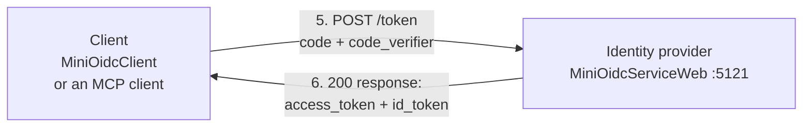
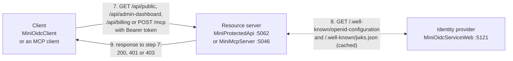
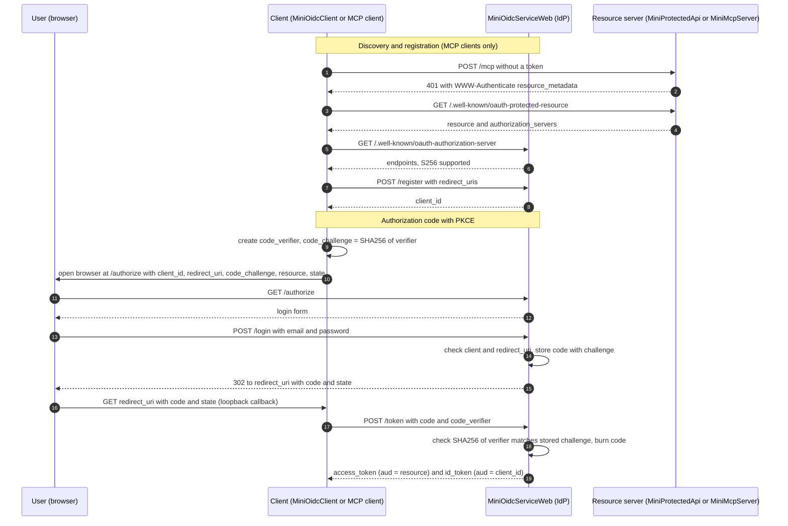
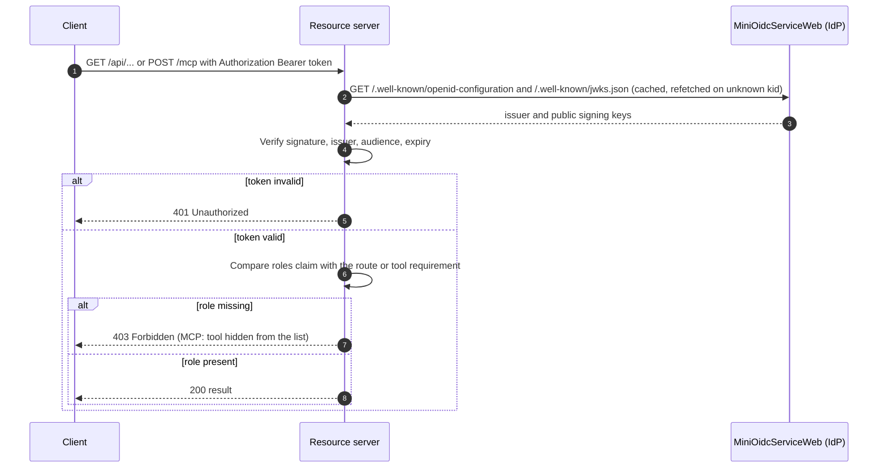

# OAuth + OIDC Learning Sandbox

A small, self-contained set of .NET 10 projects that demonstrate how OAuth 2.0 / OpenID Connect login and token-based authorization work end to end: an identity provider, a console client, a protected REST API, and a protected MCP server.

Everything is a **mock for learning**. State is in memory, passwords are plaintext, and nothing here is production-ready (see [Limitations](#limitations)).

## Projects

| Project | Kind | Default URL | What it does |
|---|---|---|---|
| **MiniOidcService** | Console app | n/a | Step-zero demo: builds and signs a JWT with a fresh RSA key and prints it (paste into jwt.io). Standalone, not used by the others. |
| **MiniOidcServiceWeb** | ASP.NET minimal API | `http://localhost:5121` | The **identity provider**. Shows a login form, issues signed JWTs, publishes its public keys and metadata, and supports dynamic client registration. |
| **MiniOidcClient** | Console app | listens on `http://localhost:8080/callback/` | A **client application**. Opens your browser to log in, catches the redirect, exchanges the code for tokens, then calls the protected API. |
| **MiniProtectedApi** | ASP.NET minimal API | `http://localhost:5062` | A **resource server**. Validates bearer tokens from the identity provider and enforces roles. |
| **MiniMcpServer** | ASP.NET MCP server | `http://localhost:5046/mcp` | A protected **MCP server** (Streamable HTTP). Same token validation, plus the discovery documents MCP clients need. |

## How the pieces talk

The numbers show the order of a login followed by an API call, split into three parts so the arrows stay readable. Each arrow points the way the message travels. The client is either MiniOidcClient or an MCP client such as Claude Code, and the resource server is either MiniProtectedApi or MiniMcpServer.

**Steps 1-4: browser login**


**Steps 5-6: token exchange**



**Steps 7-9: calling the protected API or MCP server**



Step 8 is a two-way dotted arrow because it is a request and its response. MCP clients also make these calls before step 1: `GET /.well-known/oauth-protected-resource` on the MCP server, then `GET /.well-known/oauth-authorization-server` and `POST /register` on the identity provider. They are shown in the sequence diagram below.

## Identity provider endpoints (MiniOidcServiceWeb)

| Endpoint | Purpose |
|---|---|
| `GET /authorize` | Validates the request (registered client, exact `redirect_uri`, `S256` PKCE) and shows the login form. |
| `POST /login` | Checks credentials, creates a one-time authorization code, redirects back to the client with `code` and `state`. |
| `POST /token` | Verifies the PKCE `code_verifier`, burns the code, returns an `access_token` and an `id_token`. |
| `POST /register` | Dynamic client registration (RFC 7591) for public clients. Accepts https or loopback-http redirect URIs. |
| `GET /.well-known/openid-configuration` and `/.well-known/oauth-authorization-server` | Metadata: endpoints, supported methods. |
| `GET /.well-known/jwks.json` | The public signing key. The RSA key is regenerated on every start, so the `kid` changes too. |

**Mock users** (password `password123`): `jane.doe@example.com` has roles `Admin` and `BillingManager`. `john.smith@example.com` has only `BillingManager`.

**Pre-registered client:** `my_learning_client_app` with redirect `http://localhost:8080/callback/`.

## Tokens

| Token | Audience (`aud`) | Purpose |
|---|---|---|
| `id_token` | the client's `client_id` | Tells the client who logged in. MiniOidcClient also sends it to MiniProtectedApi as a shortcut. |
| `access_token` | the `resource` the client asked for (falls back to `client_id`) | What an API or MCP server should accept. Audience binding stops a token for one service being replayed at another. |

Both are RS256 JWTs carrying `iss`, `sub` (email), `name`, `roles`, `exp`, `iat`. The access token also carries `client_id` and `scope`.

## Protected resources

**MiniProtectedApi** (audience `my_learning_client_app`)

| Route | Requires |
|---|---|
| `/api/public` | nothing |
| `/api/admin-dashboard` | role `Admin` |
| `/api/billing` | role `BillingManager` |

**MiniMcpServer** (audience `http://localhost:5046`)

| Tool | Requires |
|---|---|
| `whoami` | any signed-in user |
| `get_billing_summary` | role `BillingManager` |
| `reset_cache` | role `Admin` |

Tools the caller isn't allowed to use are hidden from their tool list and rejected if called directly.

## Authentication flow

Authorization code flow with PKCE. MCP clients also do the discovery and registration steps first. MiniOidcClient skips them because it is pre-registered and its URLs are hardcoded.



## Authorization flow

Every call to a resource server goes through the same checks.



## Running it

Start in this order, each in its own terminal:

```bash
dotnet run --project MiniOidcServiceWeb --urls http://localhost:5121   # identity provider
dotnet run --project MiniProtectedApi   --urls http://localhost:5062   # REST API
dotnet run --project MiniMcpServer      --urls http://localhost:5046   # MCP server
dotnet run --project MiniOidcClient                                    # opens browser, click Sign In
```

The client prints the token response, then the result of `/api/public`, `/api/admin-dashboard` and `/api/billing`.

To use the MCP server from Claude Code:

```bash
claude mcp add --transport http mini-oidc http://localhost:5046/mcp
```

Then start a new conversation, run `/mcp`, select `mini-oidc` and choose **Authenticate**.

## Limitations

- **In-memory state:** restarting the identity provider forgets registered clients and pending codes, and generates a new signing key. Resource servers refetch keys within about 5 seconds, so the first call after a restart can fail once.
- **No refresh tokens.** Tokens last one hour, then the client must log in again.
- **Mock security:** plaintext passwords, a hardcoded user list, no consent screen, no rate limiting, plain HTTP on localhost.
- **MiniOidcClient shortcuts:** it sends no `state` (so no CSRF check), doesn't validate the `id_token`, and uses the `id_token` rather than an access token when calling the API.
- **`iss` follows the request address** (for example `http://localhost:5121`), so a resource server's authority must use the same address the identity provider was reached at.
