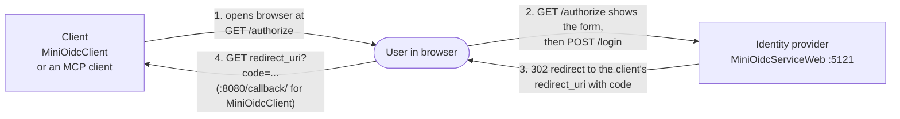
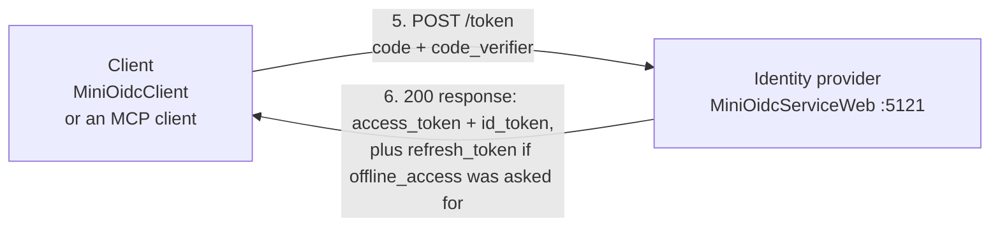
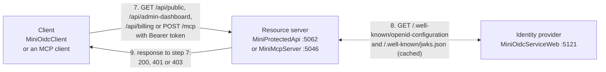
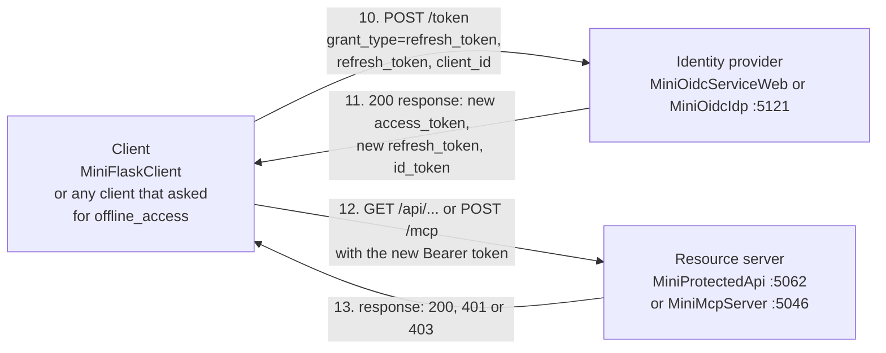
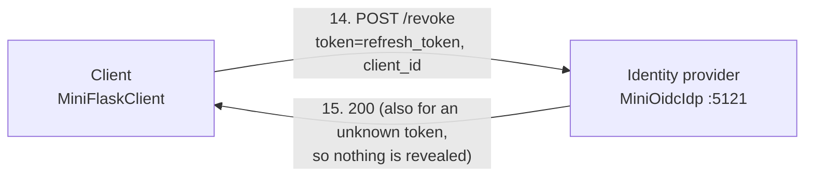
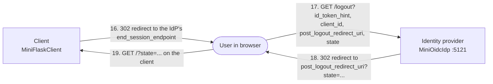
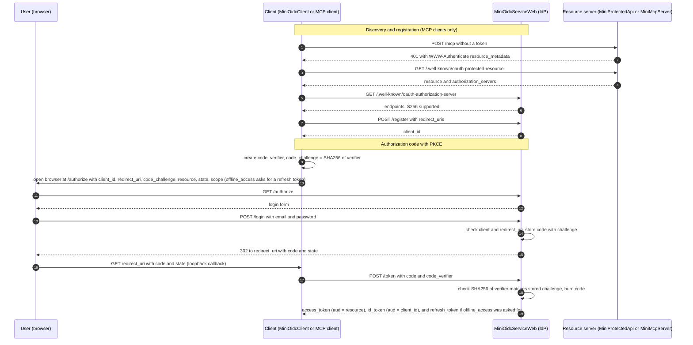
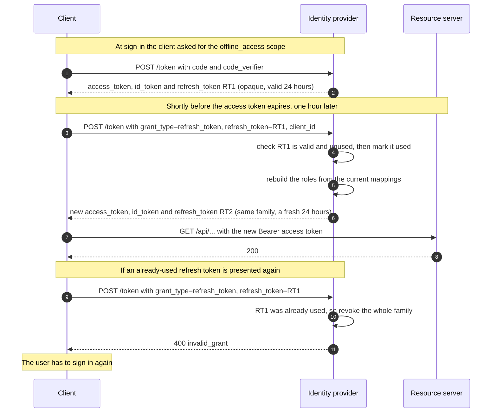
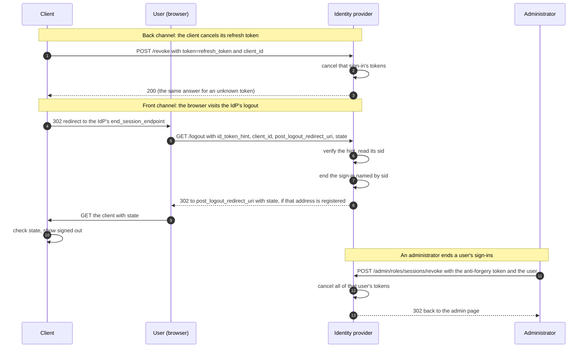
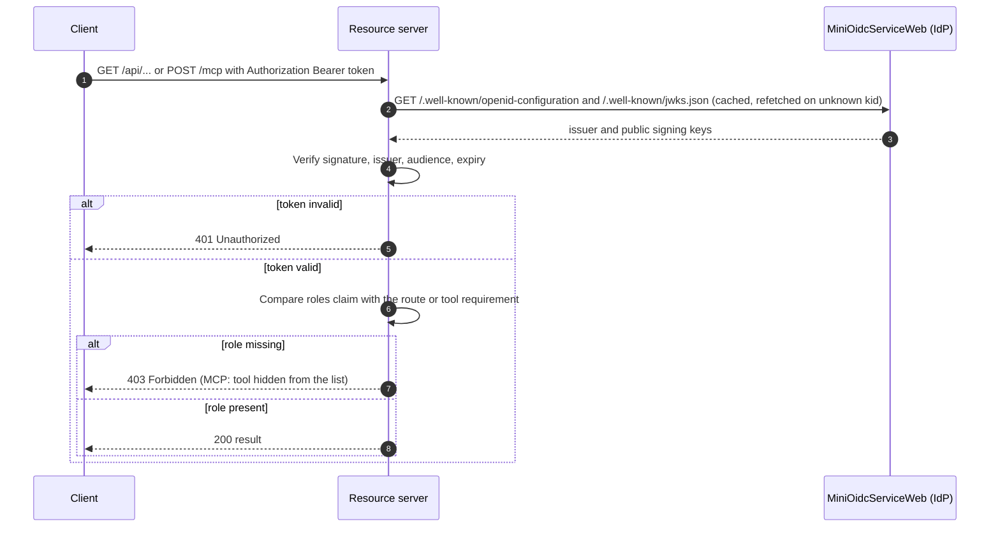

# OAuth + OIDC Learning Sandbox

A small, self-contained set of .NET 10 projects that demonstrate how OAuth 2.0 / OpenID Connect login and token-based authorization work end to end: an identity provider, a console client, a protected REST API, and a protected MCP server.

Everything is a **mock for learning**. State is in memory, passwords are plaintext, and nothing here is production-ready (see [Limitations](#limitations)).

## Projects

| Project | Kind | Default URL | What it does |
|---|---|---|---|
| **MiniOidcService** | Console app | n/a | Step-zero demo: builds and signs a JWT with a fresh RSA key and prints it (paste into jwt.io). Standalone, not used by the others. |
| **MiniOidcServiceWeb** | ASP.NET minimal API | `http://localhost:5121` | The **identity provider**. Shows a login form, issues signed JWTs, publishes its public keys and metadata, and supports dynamic client registration. |
| **MiniOidcIdp** | ASP.NET minimal API | `http://localhost:5121` | An alternative **identity provider** with pluggable sign-in (fake users, or Windows authentication), group-to-role mapping you can edit in a browser, token revocation and logout, and optional storage of its state in SQLite or SQL Server. Same core endpoints as MiniOidcServiceWeb, so run one or the other. See [MiniOidcIdp](#minioidcidp-role-mapping-and-windows-sign-in). |
| **MiniOidcClient** | Console app | listens on `http://localhost:8080/callback/` | A **client application**. Opens your browser to log in, catches the redirect, exchanges the code for tokens, then calls the protected API. |
| **MiniFlaskClient** | Python Flask app | `http://localhost:8080` | A web **client application** in Python. Signs you in through the IdP (authorization code + PKCE, ID token checked against the IdP's keys), calls the API's three endpoints with the access token, and shows each result. It asks for a refresh token, renews the access token before it expires, and on sign-out revokes the refresh token and logs out at the IdP. Shares port 8080 with MiniOidcClient, so run one at a time. |
| **MiniProtectedApi** | ASP.NET minimal API | `http://localhost:5062` | A **resource server**. Validates bearer tokens from the identity provider and enforces roles. |
| **MiniMcpServer** | ASP.NET MCP server | `http://localhost:5046/mcp` | A protected **MCP server** (Streamable HTTP). Same token validation, plus the discovery documents MCP clients need. |

## How the pieces talk

The numbers show the order of a login followed by an API call, split into three parts so the arrows stay readable. Each arrow points the way the message travels. The client is either MiniOidcClient or an MCP client such as Claude Code, and the resource server is either MiniProtectedApi or MiniMcpServer.

**Steps 1-4: browser login**



**Steps 5-6: token exchange**



**Steps 7-9: calling the protected API or MCP server**



Step 8 is a two-way dotted arrow because it is a request and its response. MCP clients also make these calls before step 1: `GET /.well-known/oauth-protected-resource` on the MCP server, then `GET /.well-known/oauth-authorization-server` and `POST /register` on the identity provider. They are shown in the sequence diagram below.

**Steps 10-13: refreshing an access token that is about to expire**

An access token lasts one hour. A client that asked for the `offline_access` scope also received a refresh token, and uses it to get a new access token without sending the user back to the login page. The numbers continue from step 9.



The refresh token is single-use. Step 11 hands back a new one, and the client must keep that and throw the old one away. If an old one is ever presented again, the IdP treats it as stolen and cancels every refresh token from that sign-in, so the user has to sign in again. The [Refresh token flow](#refresh-token-flow) section below shows this in detail.

**Steps 14-15: revoking a refresh token (back channel)**

When a user signs out, the client tells the IdP to cancel its refresh token. This is MiniOidcIdp only, since MiniOidcServiceWeb has no revocation endpoint.



**Steps 16-19: logging out through the browser (front channel)**



## Identity provider endpoints (MiniOidcServiceWeb)

| Endpoint | Purpose |
|---|---|
| `GET /authorize` | Validates the request (registered client, exact `redirect_uri`, `S256` PKCE) and shows the login form. |
| `POST /login` | Checks credentials, creates a one-time authorization code, redirects back to the client with `code` and `state`. A wrong email or password shows the login form again with a generic "Incorrect email or password" message and keeps the request details so the user can retry. |
| `POST /token` | Two grants. `authorization_code`: verifies the PKCE `code_verifier`, burns the code, returns an `access_token` and an `id_token` (and a `refresh_token` if the request asked for the `offline_access` scope). `refresh_token`: swaps a refresh token for a new set of tokens. |
| `POST /register` | Dynamic client registration (RFC 7591) for public clients. Accepts https or loopback-http redirect URIs. |
| `GET /.well-known/openid-configuration` and `/.well-known/oauth-authorization-server` | Metadata: endpoints, supported methods. |
| `GET /.well-known/jwks.json` | The public signing key. The RSA key is regenerated on every start, so the `kid` changes too. |

**Mock users** (password `password123`): `jane.doe@example.com` has roles `Admin` and `BillingManager`. `john.smith@example.com` has only `BillingManager`.

**Pre-registered client:** `my_learning_client_app` with redirect `http://localhost:8080/callback/`.

**Token lifetimes:** both IdPs read `Tokens:AccessTokenSeconds` (default 3600) and `Tokens:RefreshTokenSeconds` (default 86400) from `appsettings.json`. Override with `Tokens__AccessTokenSeconds=6` and so on, which is handy for watching a refresh happen without waiting an hour.

## MiniOidcIdp: role mapping and Windows sign-in

MiniOidcIdp is meant for setups where users already sign in with Windows (NTLM or Kerberos) and downstream services can't receive that identity directly. The IdP does the Windows sign-in once and issues tokens the other services can validate. It changes two things compared with MiniOidcServiceWeb:

1. **Where the user comes from** (`Idp:AuthenticationMode` in `appsettings.json`):

   | Mode | Sign-in | Use for |
   |---|---|---|
   | `Persona` (default) | The login form, checked against fake users in `Idp:Personas` | Linux, or any development without Windows auth |
   | `WindowsKestrel` | Windows authentication through the Negotiate handler, no form | Windows development on Kestrel |
   | `WindowsIis` | Windows authentication done by IIS, no form | The IIS deployment |

2. **Where roles come from:** the token's `roles` are not hardcoded. Each user's groups (AD, local, or persona groups) are matched against `Idp:RoleMappings`, for example `DEMO\App-Billing` to `BillingManager`. A mapping's group can be a name (`DOMAIN\Group`) or a SID. A SID survives a group rename.

Other differences: the token `sub` is the user's SID, and a `preferred_username` claim carries the account name.

**Admin page:** `http://localhost:5121/admin/roles` (raw JSON at `/admin/roles.json`). For each user it shows their groups, which mappings matched, and the roles that go into their token. It also lets you add and remove mappings, with a shortcut to map a group you can see in the list.
- It is on by default only in Development (`Idp:EnableAdminUi`).
- Roles are worked out at sign-in, so an edit affects new sign-ins only. Tokens already issued keep their old roles until they expire.
- Edits are saved to `role-mappings.json` (in `%LOCALAPPDATA%\MiniOidc` or `~/.local/share/MiniOidc`, or the path in `Idp:MappingsFile`). That file overrides the mappings in `appsettings.json`. Delete it to go back to them.
- In Windows modes, only members of `Idp:AdminGroup` can edit, and if it is empty nobody can. Every edit needs an anti-forgery token, since a browser sends Windows credentials automatically, and each edit is logged with who made it.
- To find your real group names, sign in to the admin page on the deployed site and read the group list.

**Testing status:** Persona mode is tested (roles, editing, persistence, and against MiniProtectedApi and MiniMcpServer unchanged). The two Windows modes compile but have not been run, because that needs a Windows machine. On a non-Windows machine they refuse to start.

**More endpoints in MiniOidcIdp** (beyond those above):

| Endpoint | Purpose |
|---|---|
| `POST /revoke` | Token revocation (RFC 7009). Hand back a refresh token and every refresh token from that sign-in stops working. Unknown, expired, repeated or another client's tokens all answer 200, so nothing is revealed. An unknown `client_id` gets 400 `invalid_client`, and an access token gets 400 `unsupported_token_type`. |
| `GET` or `POST /logout` | Logout (OpenID Connect RP-Initiated Logout). Send the `id_token` as `id_token_hint`. Its signature is checked (even if expired), and the sign-in named by its `sid` claim is ended. The browser is redirected to `post_logout_redirect_uri` (with `state`) only if that address is registered for the client. Without a valid hint nothing is ended and nobody is redirected. |
| `GET /admin/roles` | The admin page, now with an **Active sign-ins** section listing who holds refresh tokens, and an **End sign-ins** button per user. |

Registered clients can be fixed in configuration (`Idp:Clients`, each with `RedirectUris` and `PostLogoutRedirectUris`) or register themselves at `/register`, which also accepts `post_logout_redirect_uris`. Set `Idp:AllowDynamicClientRegistration` to `false` to turn `/register` off (recommended once the IdP holds real data, since it is open to anyone). Registration is limited to 10 addresses per client, 2048 characters each, and 1000 dynamic clients.

## Keeping state in a database (SQLite or SQL Server)

By default MiniOidcIdp keeps everything in memory, so a restart invalidates every token, forgets registered clients and signs everyone out. Setting `Persistence:Provider` to `Sqlite` or `SqlServer` keeps that state in a database instead, so it survives restarts and several IdP servers can share it.

| State | Stored as |
|---|---|
| Signing keys | The private key encrypted with AES-GCM, using the key you supply. Several rows during a rotation. |
| Authorization codes | Only a SHA-256 hash of the code, expiring after 5 minutes |
| Refresh tokens | Only a SHA-256 hash of the token, with the sign-in it belongs to |
| Dynamically registered clients | As registered. Clients fixed in `Idp:Clients` stay in configuration. |
| Role mappings | Seeded once from configuration, then edited on the admin page |
| ASP.NET Data Protection keys | So the admin page's anti-forgery tokens work on every server |

**Turning it on** (SQLite example):

```bash
export Persistence__Provider=Sqlite
export Persistence__ConnectionString="Data Source=/var/lib/miniidp/idp.db"
export Persistence__EncryptionKey="$(openssl rand -base64 32)"   # generate ONCE and keep it, see below
dotnet run --project MiniOidcIdp --urls http://localhost:5121
```

For SQL Server use `Provider=SqlServer` and an ordinary connection string. The schema is created and updated on startup (`Persistence:AutoMigrate`, on by default).

| Setting | Meaning | Default |
|---|---|---|
| `Persistence:Provider` | `None` (memory), `Sqlite` or `SqlServer` | `None` |
| `Persistence:ConnectionString` | The database | none |
| `Persistence:EncryptionKey` | 32 random bytes, base64. **Required** with a database | none |
| `Persistence:AutoMigrate` | Apply schema changes at startup. When `false`, startup stops if migrations are pending | `true` |
| `Persistence:SigningKeyRotationDays` | A new signing key is added when the newest is this old | 90 |
| `Persistence:SigningKeyRetentionDays` | An old key stays published this long after it is replaced, so tokens it signed still verify | 7 |
| `Persistence:CleanupIntervalSeconds` | How often expired codes, tokens and keys are removed | 600 |
| `Tokens:AuthorizationCodeSeconds` | How long a code can be redeemed (also applies without a database) | 300 |
| `Tokens:RefreshTokenMaxSeconds` | Absolute limit on a sign-in's refresh chain, counted from the original sign-in, however often it is used | 604800 (7 days) |
| `Idp:Issuer` | A fixed issuer for tokens and metadata. Without it the issuer comes from the request address | none |

**The encryption key is as important as the database.** It protects the private signing key. Keep it in an environment variable or a secret store, never in `appsettings.json` or git. Back it up separately from the database. If it is lost, or replaced with a different one, the IdP refuses to start rather than quietly make a new key, because a new key would make every token already issued stop validating.

**How several servers cooperate.** They share the database, so any server can redeem a code or refresh token another issued. Whichever request removes a code (or marks a refresh token used) first wins, and a simultaneous second attempt is refused. A new signing key waits two minutes before it signs, so every server has published it first. The JWKS lists every stored key. Set `Idp:Issuer` to the one public address of the IdP, because the issuer must be identical whichever server answers, and resource servers' `Auth:Authority` must match it. SQLite works for several processes on one machine, but not across machines (it needs a local disk). Use SQL Server for several IIS servers.

**Schema changes.** The schema is managed with EF Core migrations, one set for each provider. To apply schema changes yourself instead of at startup (often preferred for SQL Server, where the app's account may not be allowed to change the schema), set `AutoMigrate` to `false` and run the generated script:

```bash
dotnet tool install --global dotnet-ef --version 10.0.12
cd MiniOidcIdp
dotnet ef migrations script --idempotent --context SqlServerIdpDbContext -o schema.sql
# after changing the model, add a migration for each provider:
dotnet ef migrations add SomeName --context SqliteIdpDbContext    --output-dir Persistence/Migrations/Sqlite
dotnet ef migrations add SomeName --context SqlServerIdpDbContext --output-dir Persistence/Migrations/SqlServer
```

**Testing status.** Tested against SQLite: restart survival, secrets stored only as hashes or ciphertext, a wrong encryption key stopping startup, two IdP processes sharing one database (including 20 simultaneous requests for one code and one refresh token, which produced exactly one success each), key rotation and retention, expiry and cleanup. **The SQL Server provider has only been compiled and its generated SQL script reviewed. It has not been run against a SQL Server**, so try it on a test database first.

**Before using it for real tokens**, beyond the settings above:

- Use `WindowsIis` or `WindowsKestrel` sign-in. Persona mode has plaintext passwords and is for development only.
- Serve it over HTTPS, and set `Idp:Issuer` to that address.
- Turn off `Idp:AllowDynamicClientRegistration` and list your applications in `Idp:Clients`.
- Set `Idp:AdminGroup` so only administrators can use the admin page, and turn the page off (`Idp:EnableAdminUi`) if you don't need it.
- Keep `Tokens:AccessTokenSeconds` short. Revoking a sign-in stops refreshing, but an access token already issued works until it expires.
- The Data Protection keys stored in the database are not encrypted. They only protect the admin page's anti-forgery tokens, but limit who can read the database.
- Still missing: login rate limiting or lockout, token introspection, logout notifications to other applications, and encryption-key rotation.

## Tokens

| Token | Audience (`aud`) | Purpose |
|---|---|---|
| `id_token` | the client's `client_id` | Tells the client who logged in. MiniOidcClient also sends it to MiniProtectedApi as a shortcut. |
| `access_token` | the `resource` the client asked for (falls back to `client_id`) | What an API or MCP server should accept. Audience binding stops a token for one service being replayed at another. |
| `refresh_token` | only the IdP's `/token` endpoint | Swaps for a new access token when the old one expires. Issued only when the client asked for `offline_access`. |

The `id_token` and `access_token` are RS256 JWTs carrying `iss`, `jti` (unique per token), `sub`, `sid` (the sign-in the token belongs to, used by logout), `name`, `preferred_username` (MiniOidcIdp only), `roles`, `exp`, `iat`. The access token also carries `client_id` and `scope`. The `offline_access` scope only asks for a refresh token, so it is left out of the access token's own `scope` claim.

**Lifetimes:** the access token and ID token last 1 hour. The refresh token lasts 24 hours and is *sliding*: every refresh returns a new refresh token with a fresh 24 hours, so a client that keeps refreshing stays signed in, but only up to an absolute cap of 7 days from the original sign-in (`Tokens:RefreshTokenMaxSeconds`), after which the user must sign in again.

**The refresh token is opaque:** a random string (`rt_...`), not a JWT. Only the IdP can say what it means, and it lives in the IdP's memory, so restarting the IdP invalidates every refresh token.

**How this compares with Entra ID and Okta** (from their documentation when checked. Confirm the details for your own tenant):

| Behavior | This repo | Entra ID | Okta |
|---|---|---|---|
| How a refresh token is requested | `offline_access` scope | `offline_access` scope | `offline_access` scope |
| Refresh request from a public client | `grant_type`, `refresh_token`, `client_id`, optional `scope` (the same or fewer scopes) | same | same |
| Refresh token format | opaque | opaque | opaque |
| Replaced on every use | yes | yes | yes by default (configurable) |
| An old token used again | revoked immediately, along with every token from that sign-in | the old token is not revoked | revoked with the rest, after a grace period (30 seconds by default) |
| Default refresh token lifetime | 24 hours, sliding | 90 days sliding (24 hours for single-page apps) | unlimited, but expires after 7 days unused (configurable) |
| Default access token lifetime | 1 hour | 60 to 90 minutes | 1 hour |
| Error for a bad refresh token | `invalid_grant` | `invalid_grant` | `invalid_grant` |
| Token revocation endpoint (RFC 7009) | yes, revokes the whole sign-in's refresh tokens | to my knowledge, no. Sign-out and administrator session revocation are used instead | yes |

Two differences to know about. This repo is stricter than Entra about a replayed token, and has no grace period, so a client that saves the new token badly or refreshes twice at once gets signed out. Also, when the IdP re-reads a user's roles at refresh time is up to the IdP: this repo does it in Persona mode (edit a mapping and the next refresh has the new roles) but not in Windows modes, which cannot re-read groups without the user's browser sign-in. The vendor docs I checked don't say what Entra and Okta do.

## Protected resources

**MiniProtectedApi** (audience `my_learning_client_app`)

| Route | Requires |
|---|---|
| `/api/public` | nothing |
| `/api/admin-dashboard` | role `Admin` |
| `/api/billing` | role `BillingManager` |

**MiniMcpServer** (audience `http://localhost:5046`)

| Tool | Requires |
|---|---|
| `whoami` | any signed-in user |
| `get_billing_summary` | role `BillingManager` |
| `reset_cache` | role `Admin` |

Tools the caller isn't allowed to use are hidden from their tool list and rejected if called directly.

## Configuring which identity provider to trust

MiniProtectedApi and MiniMcpServer read an `Auth` section from their `appsettings.json`, so pointing them at a different identity provider (Entra ID, Okta, and so on) is a configuration change. They refuse to start if `Authority` or `Audience` is missing.

| Setting | Meaning | Default in the repo |
|---|---|---|
| `Authority` | The provider's issuer URL. Its discovery document and signing keys are found from here. | `http://localhost:5121` |
| `Audience` | What the token's `aud` claim must be, meaning the token was issued for this service. | API: `my_learning_client_app`. MCP: `http://localhost:5046`. |
| `RoleClaimType` | The token claim that holds roles. | `roles` |
| `RequireHttpsMetadata` | Requires the provider's URLs to be HTTPS. Leave it `true` (the code default) for real providers. | `false` in `appsettings.json` for local HTTP |
| `MetadataRefreshSeconds` | How quickly signing keys are refetched after an unknown key. Only useful for the mock IdP, which makes a new key on every restart. Leave it out for real providers. | `5` |
| `Resource` (MCP only) | This server's own address, published to MCP clients. Defaults to `Audience`. | `http://localhost:5046` |
| `Scopes` (MCP only) | Scopes advertised to MCP clients. | `mcp:tools` |

Override any setting without editing the file by using an environment variable with `__` between the parts, for example `Auth__Authority=http://localhost:5400`. `Auth__Scopes__0=mcp:tools` sets the first scope.

Illustrative values for other providers (verify in your tenant, since these depend on how the app registration is set up):

```jsonc
// Entra ID
"Auth": {
  "Authority": "https://login.microsoftonline.com/<tenant-id>/v2.0",
  "Audience": "api://<api-app-id>",
  "RoleClaimType": "roles"
}

// Okta (custom authorization server)
"Auth": {
  "Authority": "https://<org>.okta.com/oauth2/<server-id>",
  "Audience": "<audience set on the authorization server>",
  "RoleClaimType": "groups"
}
```

Config alone is not the whole swap. Request the `offline_access` scope if you want a refresh token from Entra ID or Okta. MiniOidcClient still has the mock IdP's endpoints, client ID and redirect URI hardcoded and sends the `id_token` to the API, and MCP clients expect dynamic client registration that real providers often restrict. `RequireHttpsMetadata` and `MetadataRefreshSeconds` should be removed from the API and MCP `appsettings.json` when you switch.

## Authentication flow

Authorization code flow with PKCE. MCP clients also do the discovery and registration steps first. MiniOidcClient skips them because it is pre-registered and its URLs are hardcoded.



## Refresh token flow



What each side does:
- **Client:** refresh a little before expiry (MiniFlaskClient does this 60 seconds early, set by `REFRESH_MARGIN_SECONDS`). Save the new refresh token every time. Never send the same refresh token twice, and never from two threads at once. If the IdP answers `invalid_grant`, send the user to sign in again.
- **IdP:** a refresh request may ask for the same or fewer scopes than were granted, never more, and a bad request does not use up the token. Every failure looks the same (`invalid_grant`, "invalid, expired or revoked") so a caller learns nothing about which tokens exist.
- **Resource servers:** nothing changes. They only ever see access tokens, and never a refresh token.

## Sign-out and revocation flow



What this does and does not do:
- **It stops renewal, not tokens already issued.** After a sign-in is ended the client cannot get new access tokens, but the access token it holds works until it expires (an hour by default, `Tokens:AccessTokenSeconds`). Keep it short if that matters.
- **A bad hint ends nothing.** A hint with a wrong signature, the wrong client, an access token instead of an `id_token`, or no hint at all just shows a "signed out" page. Nobody is redirected unless the address is registered for the client.
- **Windows sign-in is not undone.** With `WindowsIis` or `WindowsKestrel` the IdP cannot sign the user out of Windows, so opening an application again signs them straight back in. Logout only ends the tokens.
- **Ending a user's sign-ins from the admin page** is the way to cut off someone who left or was disabled, since the IdP cannot see that change in Windows on its own.

## Authorization flow

Every call to a resource server goes through the same checks.



## Running it

Start in this order, each in its own terminal:

```bash
dotnet run --project MiniOidcServiceWeb --urls http://localhost:5121   # identity provider
dotnet run --project MiniProtectedApi   --urls http://localhost:5062   # REST API
dotnet run --project MiniMcpServer      --urls http://localhost:5046   # MCP server
dotnet run --project MiniOidcClient                                    # opens browser, click Sign In
```

To use MiniOidcIdp instead, start it in place of MiniOidcServiceWeb (both use port 5121): `dotnet run --project MiniOidcIdp --urls http://localhost:5121`.

The client prints the token response, then the result of `/api/public`, `/api/admin-dashboard` and `/api/billing`.

To try the Python client instead of MiniOidcClient (needs Python 3.10 or newer):

```bash
cd MiniFlaskClient
python3 -m venv .venv
.venv/bin/pip install -r requirements.txt     # Windows: .venv\Scripts\pip
.venv/bin/python app.py                       # Windows: .venv\Scripts\python app.py
```

Open `http://localhost:8080`, choose **Sign in and call the API**, and the results page shows who you are, your roles, and the status of each endpoint. The page also shows whether a refresh token is held and how many times the tokens have been refreshed, with a **Refresh tokens now** button to force one. It is configured with environment variables: `IDP_BASE_URL`, `API_BASE_URL`, `CLIENT_ID`, `REDIRECT_URI`, `PORT`, `SCOPE` (default `openid profile offline_access`), `REFRESH_MARGIN_SECONDS` (default 60), `POST_LOGOUT_REDIRECT_URI` (default `http://localhost:8080/`, which must be registered for the client) and `FLASK_SECRET_KEY`. **Sign out** revokes the refresh token at the IdP and sends the browser through the IdP's logout page, and against an IdP without those endpoints (MiniOidcServiceWeb) it just clears the local session. The redirect URI must be registered with the IdP, and only `http://localhost:8080/callback/` is pre-registered, so changing the port also needs a new registration.

To use the MCP server from Claude Code:

```bash
claude mcp add --transport http mini-oidc http://localhost:5046/mcp
```

Then start a new conversation, run `/mcp`, select `mini-oidc` and choose **Authenticate**.

## Limitations

- **In-memory state (the default):** restarting the identity provider forgets registered clients and pending codes, and generates a new signing key. MiniOidcIdp can keep this in a database instead (see above). Resource servers refetch keys within about 5 seconds, so the first call after a restart can fail once.
- **Refresh tokens are basic.** By default they are kept in the IdP's memory, so a restart signs everyone out (use a database to avoid that). MiniOidcClient does not use them. A replayed token has no grace period, and there is no token introspection, so a revoked sign-in still works until its access token expires.
- **Mock security:** plaintext passwords, a hardcoded user list, no consent screen, no rate limiting, plain HTTP on localhost.
- **MiniOidcClient shortcuts:** it sends no `state` (so no CSRF check), doesn't validate the `id_token`, and uses the `id_token` rather than an access token when calling the API.
- **`iss` follows the request address** (for example `http://localhost:5121`), so a resource server's authority must use the same address the identity provider was reached at.
